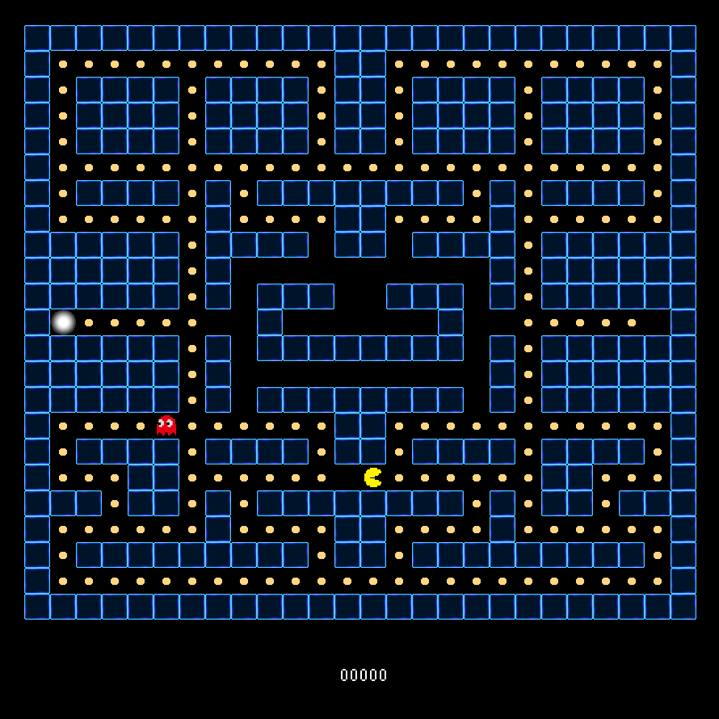

# so_long



## Requirements

Install the following libraries:

```bash
sudo apt-get -y install libbsd-dev
```

## How to run

```bash
make
./so_long maps/map.ber
```

## How to play

- Use `W`, `A`, `S`, `D` to move the player.
- Collect all the collectibles and reach the exit to win the game.
- Press `ESC` to exit the game.
